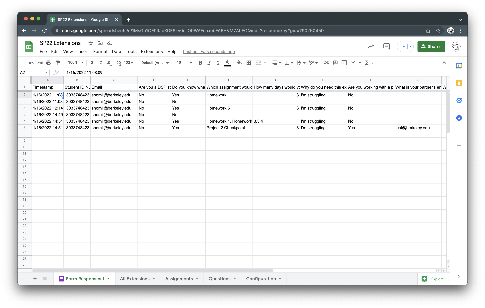
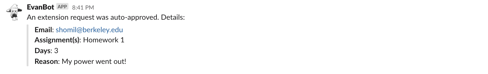
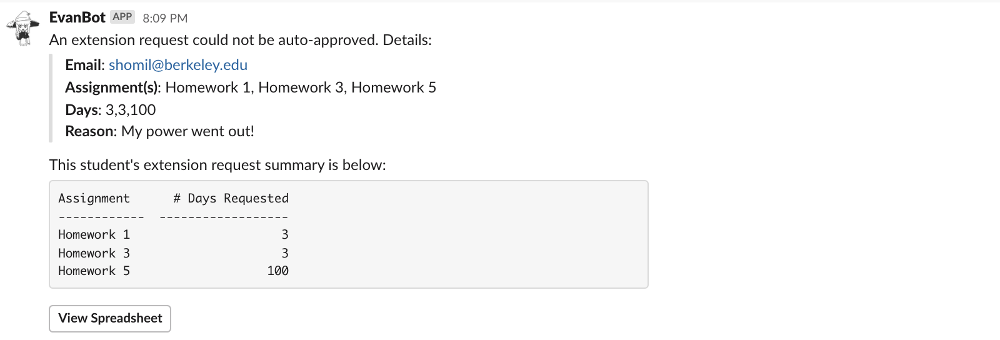
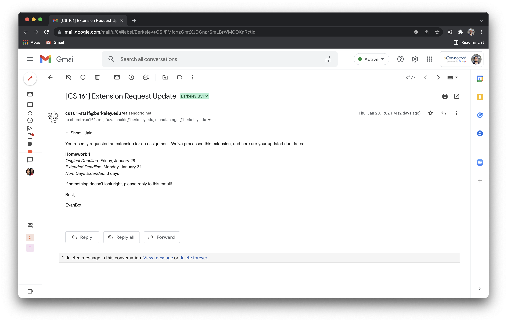
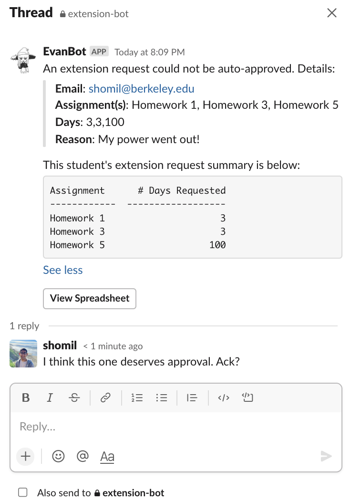
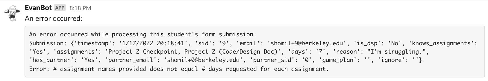

# CS 161 Extensions Backend

This extensions backend was designed to simplify the process of receiving, approving, and managing extensions in a class with hundreds (or thousands) of students.

Here's how it works:

**The student requests an extension. This can be for a specific assignment or assignments, or a general request for a student support one-on-one.**

Here's an example [extension request form](https://docs.google.com/forms/d/e/1FAIpQLSesAZzIhSEZQvpxZB0jvd-m4KLLZb9fGPGgCgGgKXtZuO0ylw/viewform) (for CS 161 Spring 2022). Here's an overview of the data collected via the form –

```
[Section 1]
Student ID Number
Email Address
Are you a DSP student with an accommodation for assignment extensions?
Do you know what assignments(s) you need extensions on?
	Yes => 2
	No => 4
----
[Section 2]
Which assignment(s) would you like an extension on?
How many days would you like an extension for?
Why do you need this extension?
Are you working with a partner on this assignment?
	Yes => 3
	No => Submit
----
[Section 3]
What is your partner's email?
What is your partner's Student ID?
=> Submit
----
[Section 4]
About how long do you think you will have issues? When are you free to chat with a TA to make a game plan for the class?
=> Submit
```

All form data is piped into a standard "Form Responses" sheet that looks like the following:



**When the form is submitted, an Apps Script trigger executes, and makes a POST Request with form data to the `handle_form_submit` Google Cloud Function endpoint.**

All processing of the form data is handled through the Python logic contained with `handle_form_submit`. In the payload, this endpoint expects...

- `spreadsheet_url` , a string pointing to the extensions sheet
- `form_data`, a JSON payload containing form responses passed from the Apps Script trigger

First, the function instantiates a connection to the spreadsheet by authenticating with a service account owned by `cs161-staff@berkeley.edu`. (Note that the sheet must be shared with this service account.)

Then, the function uses [gspread](https://docs.gspread.org/en/latest/), a wrapper around the Google Sheets API, to pull the "student record object" -  a row of the "Roster" tab of the extensions sheet. *This sheet is the ultimate source of truth for everything extensions related.* Here's what it looks like:


Here's the overall flow of the function:

1. **It pipes data from the "Form Responses" sheet to the Roster, overwriting data in-place if a student submits a form multiple times.** This is "summary-style" data: the roster only contains the number of requested days for extensions, and the reason for the extension request remains in the "Form Responses." More on this later.

2. **It processes the extension request.**

   - **If the extension is able to be approved automatically** (e.g. it's an extension request of less than three days), the function updates the `approval_status` column to **Auto-Approved**, sends an email, and updates the `email_status` column to **Auto-Sent**. Then, it sends this to a private Slack channel.
     

   - **If the extension requires manual approval** (e.g. it's more than three days), the function updates the `approval_status` column to **Pending** and the `email_status` column to **Pending Approval**. Then, it sends this to a private Slack channel:
     

---

At this point, if the extension was automatically approved, nothing else needs to happen. The student will receive an email immediately that looks something like the following.



---

**However, if the extension requires manual approval, then a few additional steps occur.** 

1. Staff deliberate on the extension request in a thread.


​	

2. Staff come to an agreement.
   - If approved (or approved with modification) –
     - Staff make modifications directly to the raw numbers in the roster (e.g. change a request from 5 days to 3).
     - Staff set the **Approval Status** column of the roster to "Manually Approved."
     - Staff set the **Email Status** column of the roster to "In Queue."
     - Staff click the **"Send Emails"** button in the toolbar, which triggers the `process_email_queue` cloud function. This iterates over all emails "in the queue" and dispatches individual emails to each of those students, updating the **Email Status** column as it goes.
   - If not approved –
     - Staff make modifications directly to the raw numbers in the roster (e.g. change a request from 5 days to 0).
     - Staff set the **Approval Status** column to "Manually Approved."
     - Staff follow up with the student over email, and set the **Email Status** column to **Manually Sent**.


---

### Handling Failures

- Extensive data validation and error checking is done throughout the codebase, especially for internal errors (e.g. configuration variables not set) or user errors (e.g. data formatting is incorrect, spreadsheets are missing, etc.).
- If an action fails halfway through a transaction, then the email is not sent and staff are paged on Slack for manual intervention.
  - The page contains an error message, as seen below.
    
  - From here, staff can choose to handle this in two ways:
    - Make the modifications to the form submission in the "Form Responses" sheet, and then use an Apps Script dropdown menu to "rerun" select form submissions through the backend. 
    - Make the modifications to the roster directly by looking over the form response manually, and then sending emails manually, or through the email queue feature noted above.
  - If a whole bunch of submissions fail (e.g. say, overnight) due to an internal issue, then the submissions at failure-time and onwards can all be selected and batch-reprocessed once the bug has been patched (so there shouldn't ever be a case where we'd have to manually process hundreds of submissions).

---

### Design Philosophy

- Avoid writing frontend code at all costs.
- Use Google Sheets as a frontend, and nothing else. Do no data manipulation in Sheets; handle all data manipulation in Python. Spreadsheets have a large learning curve, and formulas are hard to write, debug, and extend beyond the raw data itself (e.g. Slack integration, state management decisions, etc.). 
- Minimize Apps Script usage. JavaScript is bug-prone and also requires a larger learning curve than Python; it's easier to raise and diagnose errors if 95% of the code is in Python.
- Avoid deploying servers. Use serverless wherever possible (e.g. cloud functions, instead of Flask apps).

