# The CS 161 Extension Pipeline

The CS 161 Extensions Pipeline is a lightweight framework designed for tracking, approving, and managing extension requests in medium and large classes (e.g. N > 50). It's optimized for courses in the EECS department at UC Berkeley, but is extensible to other departments and universities.

At a high level, this pipeline consists of:

- A **[Google Form](https://forms.gle/m25EswwXMpq6vqrp7)** that students submit extension requests to.
- A **[Google Sheet](https://docs.google.com/spreadsheets/d/1BabID1n6fPgeuuO4-1r3mkoQ9Nx5dquNwdsET75In1E/edit#gid=790260459)** that collects student extension requests and tracks all extension requests in a master roster.
- A **Google Cloud Function** that contains core business logic that:
  - Receives form data through a simple **Google Apps Script** trigger.
  - Process form data in combination with a student's "record" (which includes DSP status and prior extension requests) to enter either an auto-approval or manual-approval flow.
  - Sends updates to staff through a **Slack Webhook**, enabling simple internal discussion of student cases through Slack threads.
  - Sends updates to students through the **CS 162 Mailserver** via **CS 61A's RPC Interface**.
  - Optionally publishes assignment extensions to one or more **Gradescope** assignments.

# Background

#### Traditional Flow

Traditionally, courses deal with two types of extensions –

1. **DSP Extensions**, for students with accommodations for assignment extensions
2. **Non-DSP Extensions**, for students facing extenuating or otherwise unforeseen circumstances

Courses traditionally collect extension requests through Google Forms (e.g. ones provided by course managers, like [this one](https://docs.google.com/forms/d/e/1FAIpQLSek1NWhh6ERQsMJqbkFhv9JtNUPBQsJ3YSoo9uqsFGJ2Lb2iA/viewform)) or via email. In order to approve these extensions, however, courses (or course managers) need to:

- Read the student's request and categorize it into a DSP or Non-DSP extension.
- Look up whether the student has previously requested assignment extensions.
- Either (a) update the student's requested extensions in a central spreadsheet, or (b) update the student's requested extension on Gradescope/OKPY/PrairieLearn.
- Send an email to the student containing an "Approved" message, with a new due date.

#### Challenges

The traditional flow results in several challenges, including:

- **High potential for human error.** In every manual step, there's a chance for data entry errors that are capable of propagating downstream; in CS 161/CS 61C, we saw a large number of these that arose at the end of the semester when generating final grade reports.
- **Communication difficulties.** For classes that outsource work to course managers, there are three parties with different views on extension data: what course managers see, what course staff see, and what students see. All communication, by default, needs to be inclusive of all three parties; if even one email is two-way instead of three-way, then information is "lost".

- **Delayed processing times.** Because of the number of manual steps required here, it can take several days for students to hear back on whether or not their requests were granted, leaving them in a state of stress and uncertainty.
- **High barriers to requesting extensions.** Because there are so many steps in approving each extension, there's a tendency to write strongly-worded policies discouraging most student extension requests.

The CS 161 Extension Pipeline addresses all of these challenges, significantly **reducing course staff workload** while simultaneously **improving quality-of-life for students**.

# Our Pipeline: Student Workflow

Students request an extension through a Google Form (see an example [here](https://docs.google.com/forms/d/e/1FAIpQLScearqptcOVkcmneQ97zJ07i-r_dtokwhb2rAtTv_WK6a2nJw/viewform)).

**If a student knows which assignments they want to request an extension on,** then they're prompted to select from a list of assignments, and provide a number of days for each extension. They can either enter a single number (which will apply to all assignments that they select), or enter comma-separated numbers (to allow them to request a different number of days for different assignments).

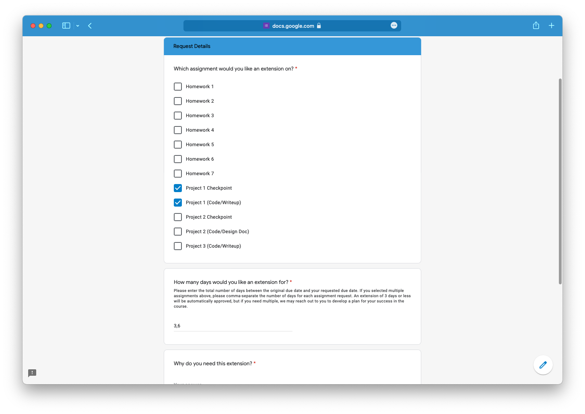

**If a student's working with one or more partners**, then they're asked to enter their partners' emails and SID's (comma-separated). Their partner(s) will be included in extensions for any assignments that they select which are marked as partner projects.

**If a student doesn't know what assignment they need an extension on,** they can request a meeting with a TA. We've seen this happen for students who're in extenuating circumstances, and just need to talk through their situation before deciding upon a specific request.

**If a student's a DSP student with an accommodation for assignment extensions,** they can declare that on the form. (We recommend that all students who fall under this category receive auto-approvals for extension requests fewer than 7 days.)

**When a student's request has been approved (either manually or automatically),** students receive a templated email with their updated assignment deadlines. 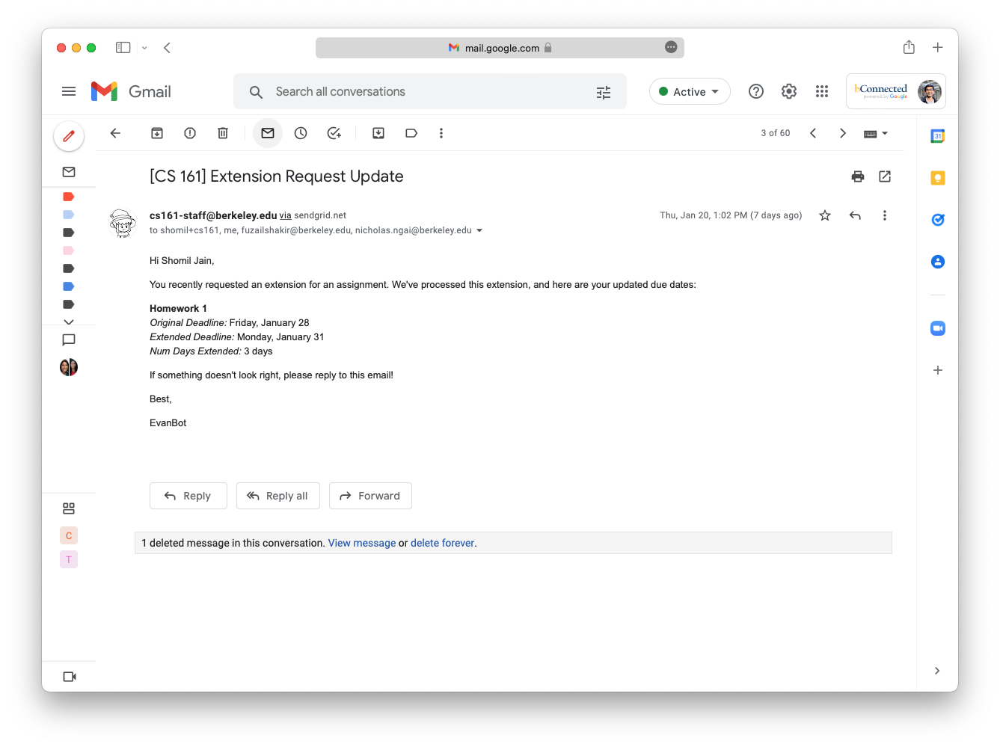

**If a class has enabled Gradescope extensions,** students will see extensions reflected in Gradescope automatically after they recieve the email with their updated deadlines, as seen below. This works for one or multiple Gradescope assignments per in-class assignment (so if you have one assignment for code and one for a written PDF, then you can paste both assignment URL's into the `Assignments` tab of the master spreadsheet, and the tool will create extensions on both Gradescope assignments).
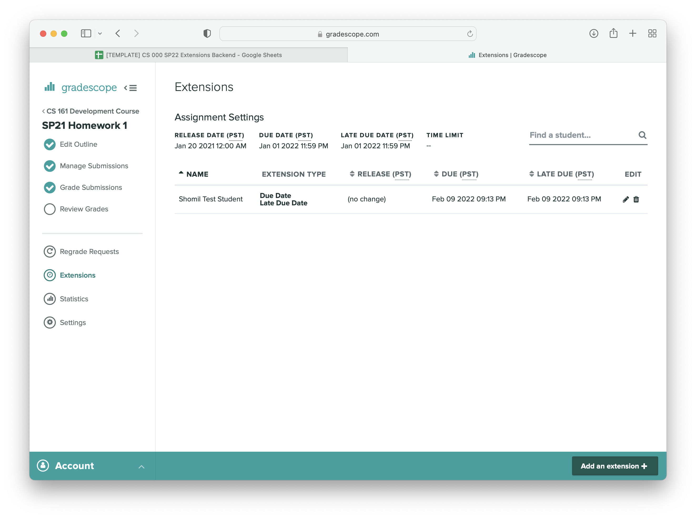

...and that's it for students!

# Our Pipeline: Staff Workflow

Staff view all extensions on a master spreadsheet, with two main tabs: a **Form Responses** tab, which contains all form responses from students, and a **Roster** tab, which contains a list of all students in the course, with a column for each assignment. The **Roster** looks like this:

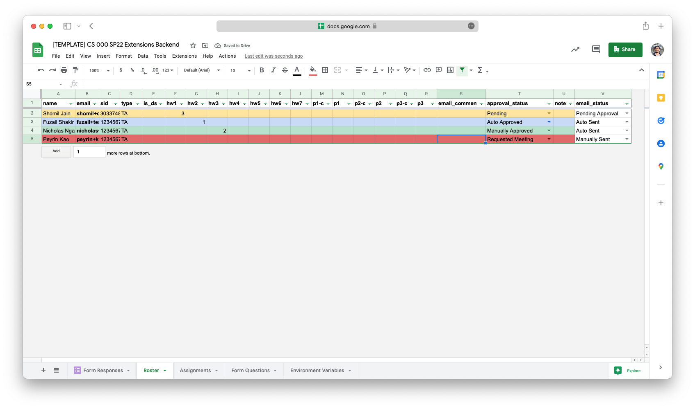

When an extension request comes in, staff first receive a Slack message in a private Slack channel.

---

**<u>If an extension request falls into an auto-approval category,</u>** the message contains a summary of the student's request, as well as a list all of their granted extensions.

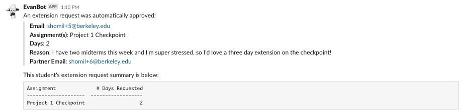

When an extension is automatically approved, staff don't need to do anything!

---

<u>**If an extension request requires manual approval**,</u> the message contains a reason why the request couldn't be auto-approved.

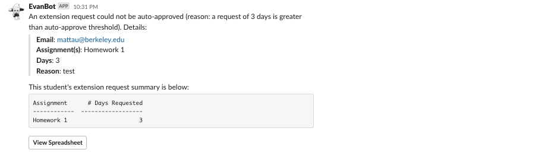

When an extension requires manual approval, staff should read the reason for the extension, and discuss the request (if needed) in the Slack thread, escalating the case to other staff (e.g. instructors) if necessary.

If the extension warrants an approval, staff should:

1. Set the **approval_status** column on the **Roster** to **"Manually Approved".**
2. Set the **email_status** column on the **Roster** to **"In Queue"**.
3. Use the **Actions => Dispatch Emails** menu item to send emails to all students in the queue. This will send emails out to the students in the queue, removing them from the queue as emails are sent, and send an update to Slack when all emails have been sent.

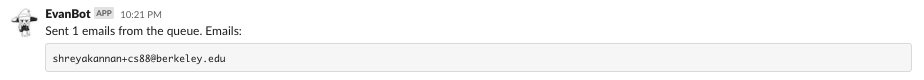

If the extension does not warrant an approval (or staff need more information), staff should:

1. Follow up with the student over email.
2. Clear the **approval_status** column on the **Roster**.
3. Set the **email_status** column on the **Roster** to **Manually Sent**.

---

**<u>If an extension request contains malformed data or any other error occurred,</u>** the message contains a description of the error, along with the entire form response.

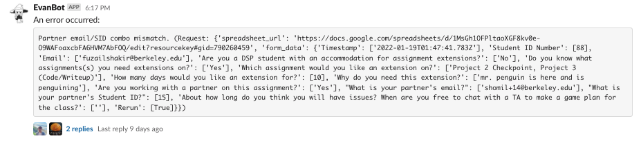

When an error occurs, staff should:

1. Correct the error on the **Form Responses** sheet (or, if it was an internal error due to other data misconfiguration - e.g. missing assignments - correct the configuration).
2. Select the **Reprocess** checkbox next to any form responses that weren't fully processed.
3. Use the **Actions => Reprocess Form Submissions** menu item to reprocess the failed submissions.

---

**<u>If a student requests a student meeting,</u>** the message contains a description of the student's request.

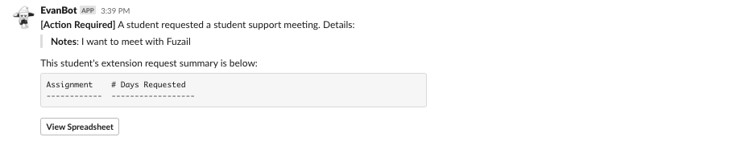

If, during a student meeting (or through some other channel, like a Piazza post), staff would like to grant a student an extension on an assignment, staff should enter the number of days to extend the assignment by directly onto the student record on the **Roster**, and throw the student record in the queue for outbound emails. This is a natural "form bypass" case, where a form submission isn't required to grant a student an extension, but these specially-granted extensions are still tracked alongside the rest of the student's extension requests.

---

# Configuration

All configuration values (e.g. API keys, email options) are stored on the spreadsheet itself, in the **"Environment Variable"** tab.

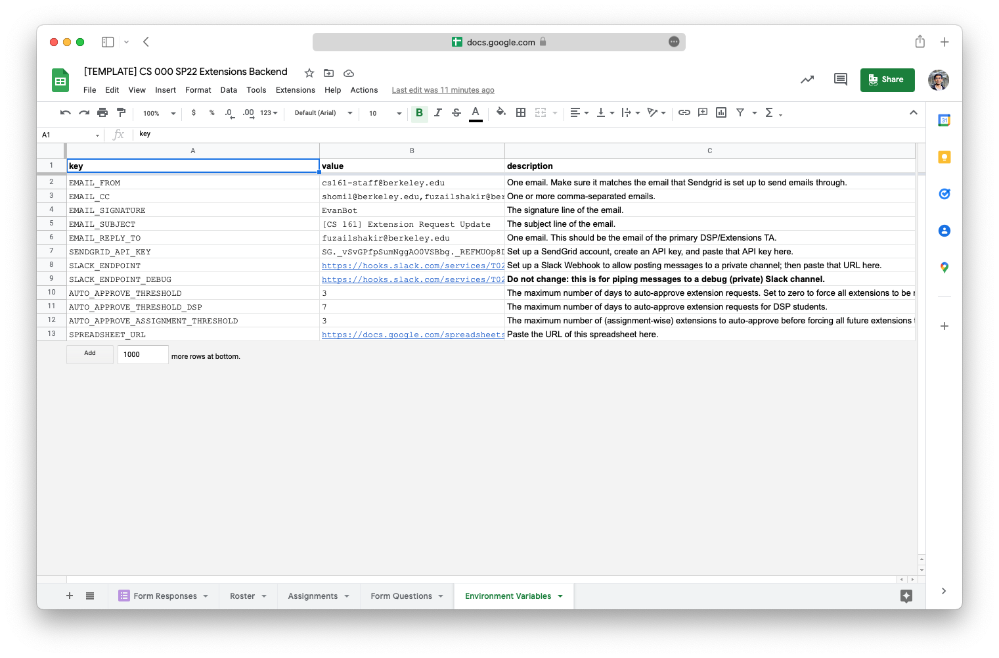

Assignments may be dynamically configured as well, through the **"Assignments"** tab.

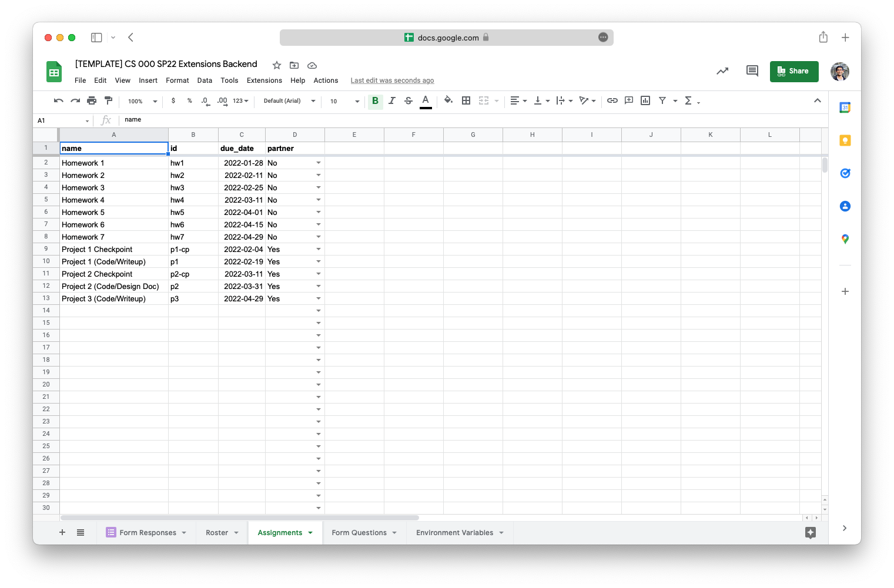

# Edge Cases & FAQ's

**<u>In what cases are extensions flagged for human approval?</u>**

These cases are flagged for human approval:

- The student requests a large number of extension days for any single assignment. This threshold is `AUTO_APPROVE_THRESHOLD` and `AUTO_APPROVE_THRESHOLD_DSP` for students with DSP accommodations for assignment extensions.
- The student requests extensions for a large number of assignments. This threshold is `AUTO_APPROVE_ASSIGNMENT_THRESHOLD`.
- The **student record** has "work-in-progress" (e.g. the row on the roster is red or yellow - the student either has an existing pending request or ongoing student meeting).

All other cases are auto-approved! [See here for the logic that handles these cases.](https://github.com/cs161-staff/extensions/blob/master/src/handle_form_submit.py#L63)

**<u>How do I make it so that all extensions (regardless of status) require manual approval?</u>**

If you want tighter control over what's approved, set `AUTO_APPROVE_THRESHOLD` to `0` and `AUTO_APPROVE_THRESHOLD_DSP` to `0`. It doesn't matter what you set `AUTO_APPROVE_ASSIGNMENT_THRESHOLD` to.

**<u>What if a student submits an extension request with one or more partners?</u>**

Any requested extensions for assignments that are "partner" assignments will apply to the designated partner(s) as well as the student. Both student records will be updated on the **Roster**, and the logic for approval will apply to all partners (e.g. if Partner A submits the form and Partner B has a "work-in-progress" record, then the extension as a whole will be flagged for manual approval).

**<u>What happens if this thing internally combusts in the middle of the semester?</u>**

While unlikely, this is a very simple failover case: just process form submissions into the **Roster** spreadsheet manually, and send templated emails through something like YAMM.

**<u>Wait, I still have to update the student's due date in OKPY/Gradescope/PL so that they'll be able to turn in their assignments late, right?</u>**

You could do this (manually) after each extension request, if you'd like. Alternatively, you could set the "late" due date on these assignments to the end of the semester, and use the extension data on the **Roster** during grade compilation (this is what CS 161 & CS 61C do). Students will see their assignments marked as "late", but they'll be able to use the email they received as proof of their granted extension, just in case they notice inconsistencies in their grade reports.

**<u>What about long-term maintenance?</u>**

Due to the simplicity of this project's architecture (no frontend, configuration is entirely dynamic, etc.), we don't anticipate this project needing a lot of long-term maintenance! And feature requests are simple to add, since the code is well-documented with Python class abstractions.

**<u>Do I need to add all students to the roster at the beginning of the semester?</u>**

No, you don't! This tool adds students to the roster on-demand (e.g. when they submit an extension request). The Google Form collects UC Berkeley emails by default, which is a robust method for identifying students and matching them to an internal CalCentral/grading roster at the end of the semester. That said, it may be useful to pre-populate rows for all students with DSP accomodations, so you have a record of who's approved for accomodations when processing extension requests.

**<u>What if I want to change an assignment deadline after extension requests have already come in?</u>**

You can handle this in any way that you'd like! Two common approaches –

1. Clear out previously-assigned extension requests, and email all students who had requested an extension to re-submit an extension if they need more days past the extended deadline. To clear out existing requests, just clear the assignment column on the **Roster.**
2. Apply all current extension requests to the new deadline. For this, update the deadline in the **Assignments** tab, filter the **Roster** to all students with an extension request for the assignment, and add all rows to the email queue; then, dispatch emails. All students who requested an extension will receive a new email with an extended deadline that's adjusted to the new deadline.
